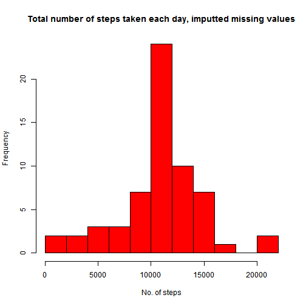

# Reproducible Research: Peer Assessment 1

This is a report from analysis of personal movement data generated by an activity monitoring device. The report is structured to show the main data analysis steps, such as data processing, data exploration and interpretation of key results. 

The data set consists of two months of data from an anonymous individual collected during the months of October and November, 2012 and include the number of steps
taken in 5 minute intervals each day.


## Loading and preprocessing the data

The code below loads the data, and sets the date variable to date format. 


```r
data<-read.csv('activity.csv') #read the file
data$date<-as.Date(data$date) #set the date variable to date format
```

## What is mean total number of steps taken per day?


```r
TotalStepsPerDay<-tapply(data$steps,data$date,sum)
hist(TotalStepsPerDay,breaks = 15,col="red",xlab="No. of steps",
     main="Total number of steps taken each day")
```

 

**As shown in the histogram, most days the subject takes 10,000 steps.**  


```r
# calculate the mean and median
meanTSPD<-mean(TotalStepsPerDay,na.rm=T)
medianTSPD<-median(TotalStepsPerDay,na.rm=T)
```

**The mean total number of steps taken per day is 1.0766 &times; 10<sup>4</sup>, and the median is 10765.**

## What is the average daily activity pattern?


```r
AveStepsPerInterval<-tapply(data$steps,data$interval,mean,na.rm=T)

# create a new vector so that the x-axis can be created
Interval<-data$interval[1:length(AveStepsPerInterval)]

plot(Interval,AveStepsPerInterval, type = "l", lwd = 3,
     main = "Average Number of Steps per Interval")
```

 


```r
# create a table with the averages per interval so that the interval can be 
# subsetted 
AveData<-cbind(Interval,AveStepsPerInterval)
# Subset to find the interval with highest steps average
IntervalWithHighestAve<-AveData[max(AveStepsPerInterval)==AveData[,2],1]
```

**The highest average number of steps occurs at 835.**

## Imputing missing values


```r
NoOfNAs<-sum(is.na(data$steps)) #calculate number of missing values
```

**The data set has 2304 missing values.**

The code below replaces all NAs with the average number of steps for the particular interval, and creates a new data sets that does not have missing values. 


```r
stepsUpdated<-data$steps # initiated a new variable

for(i in 1:length(stepsUpdated)){ # loop through all steps values
        if(is.na(stepsUpdated[i])){ # if the value is NA
                # replace the NA value with the average valueu for that interval
                stepsUpdated[i]<-AveData[data$interval[i]==AveData[,1],2]
        }
}

# create a new data set i.e replace the steps variable 
# with the stepsUpdated variable
dataUpdated<-cbind(stepsUpdated,data[,2:3])
```


```r
# Plot the histogram for the updated data set
TotalStepsPerDayUpdated<-tapply(dataUpdated$stepsUpdated,dataUpdated$date,sum)
hist(TotalStepsPerDayUpdated,breaks = 15,col="red",xlab="No. of steps",
     main="Total number of steps taken each day, imputted missing values")
```

 

As shown in the histogram above, replacing the missing values has not changed the data set i.e. the distribution of total number of steps for the updated data set is identical to the distribution for the original data set. 


```r
# calculate the mean and median
meanTSPDU<-mean(TotalStepsPerDayUpdated)
medianTSPDU<-median(TotalStepsPerDayUpdated)
```

**For the updated data set, the mean total number of steps taken per day is 1.0766 &times; 10<sup>4</sup>, and the median is 1.0766 &times; 10<sup>4</sup>.**


```r
# Difference in mean values

diff1<-mean(TotalStepsPerDayUpdated)-mean(TotalStepsPerDay,na.rm=T)

# Difference in median values as a percentage of original median value

diff2<-(median(TotalStepsPerDayUpdated)-median(TotalStepsPerDay,na.rm=T)) /
        median(TotalStepsPerDayUpdated)*100
```

The difference in mean value in the original and updated data set is 0, and the difference in the median value as a percentage of the original value is 0.011%. The small difference suggests that replacing the NA values with average values for that interval has insignificant impact on the estimates of the total number of steps.


## Are there differences in activity patterns between weekdays and weekends?

The code below adds a new factor variable in the dataset with two levels – “weekday” and “weekend” indicating whether a given date is a weekday or weekend
day. The second half of the code produces the plot. 


```r
# create a new factor variable for weekday/weekend

Weekdays<-numeric(length(dataUpdated[,2])) # initiate a new variable

for(i in 1:length(dataUpdated[,2])){ # loop through all days
        # if the value is Saturday or Sunday
        if(weekdays(dataUpdated[i,2]) %in% c("Saturday","Sunday")==TRUE){ 
                # make the value in weekdays = weekend
                Weekdays[i]<-c("weekend")
        }else{
                Weekdays[i]<-c("weekday")
        }
}

# append the Weekdays variable to the dataset

dataUpdate2<-cbind(dataUpdated,Weekdays)

# create a plot

library(ggplot2)
a<-ggplot(dataUpdate2,aes(interval,stepsUpdated)) # plot steps against interval
# plot the average, and create a line type chart
a+stat_summary(fun.y = mean, geom = "line",size = 1.5,color = "blue")+ 
        # create a facet broken down by type of day in the week
        facet_grid(Weekdays~.)+
        # add a label and black and white theme
        labs (x = "Interval/ Time of day",y = "Average number of steps")+
        labs (title = "Activity patterns")+
        theme_bw()
```

 


The plot above shows the average number of steps taken during the day. As shown, the activity patterns are different; during weekdays most activity takes place in the morning and during weekends activity is spread out during the day. 

